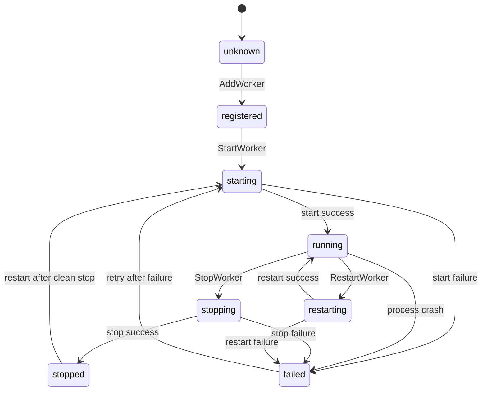

# Worker State Machine Documentation

**Date**: December 2024  
**Scope**: HSU Master Worker State Management

## Overview

The HSU Master implements a comprehensive state machine for managing worker lifecycle operations. This prevents race conditions, duplicate operations, and provides clear visibility into worker status.

## Worker States

### State Definitions

| State | Description | Purpose |
|-------|-------------|---------|
| **`unknown`** | Initial state before worker registration | Starting point for all workers |
| **`registered`** | Worker added to master but not started | Worker exists but is inactive |
| **`starting`** | Start operation in progress | Prevents duplicate start operations |
| **`running`** | Worker is running normally | Operational state for active workers |
| **`stopping`** | Stop operation in progress | Prevents operations during shutdown |
| **`stopped`** | Worker stopped cleanly | Clean shutdown completed |
| **`failed`** | Worker failed to start or crashed | Error state requiring intervention |
| **`restarting`** | Restart operation in progress | Prevents operations during restart |

## State Transitions

### Valid Transitions



### Transition Matrix

| From State | Valid Next States | Operations |
|------------|-------------------|------------|
| `unknown` | `registered` | AddWorker |
| `registered` | `starting` | StartWorker |
| `starting` | `running`, `failed` | start success/failure |
| `running` | `stopping`, `failed`, `restarting` | StopWorker, crash, RestartWorker |
| `stopping` | `stopped`, `failed` | stop success/failure |
| `stopped` | `starting` | restart after clean stop |
| `failed` | `starting` | retry after failure |
| `restarting` | `running`, `failed` | restart success/failure |

## Operation Validation

### Allowed Operations by State

| Operation | Allowed States | Description |
|-----------|----------------|-------------|
| **`add`** | `unknown` | Register worker with master |
| **`start`** | `registered`, `stopped`, `failed` | Start worker process |
| **`stop`** | `running` | Stop worker process |
| **`restart`** | `running` | Restart worker process |
| **`remove`** | `registered`, `stopped` | Remove worker from master |

### Invalid Operations

The state machine prevents these common error scenarios:

- **Double Start**: Starting a worker that's already `running` or `starting`
- **Stop Non-Running**: Stopping a worker that's not `running`
- **Concurrent Operations**: Starting while `stopping` or vice versa
- **Remove Active**: Removing a worker that's `running` or in transition states

## Implementation Details

### Thread Safety

- **Read-Write Mutex**: State machine uses `sync.RWMutex` for thread-safe access
- **Atomic Operations**: State transitions are atomic and logged
- **Lock-Free Reads**: State queries don't block other operations

### State Persistence

- **Transition History**: Complete history of all state changes
- **Error Context**: Failed transitions include error information
- **Timestamps**: All transitions include precise timing
- **Operation Tracking**: Each transition records the triggering operation

### Logging Integration

```go
// Example state transition logs
2024/12/20 00:59:38 Worker state transition, worker: test-managed, unknown->registered, operation: add
2024/12/20 00:59:38 Worker state transition, worker: test-managed, registered->starting, operation: start
2024/12/20 00:59:38 Worker state transition, worker: test-managed, starting->running, operation: start
```

## API Reference

### Core Methods

```go
// Get current state
state := stateMachine.GetCurrentState()

// Check if transition is valid
canStart := stateMachine.CanTransition(WorkerStateStarting)

// Validate operation
err := stateMachine.ValidateOperation("start")

// Perform transition
err := stateMachine.Transition(WorkerStateRunning, "start", nil)

// Get comprehensive state info
info := stateMachine.GetStateInfo()
```

### Master Integration

```go
// Master methods using state machine
err := master.AddWorker(worker)           // unknown -> registered
err := master.StartWorker(ctx, "worker1") // registered -> starting -> running
err := master.StopWorker(ctx, "worker1")  // running -> stopping -> stopped
err := master.RemoveWorker("worker1")     // stopped -> (removed)

// State inquiry methods
state, err := master.GetWorkerState("worker1")
info, err := master.GetWorkerStateInfo("worker1")
allStates := master.GetAllWorkerStates()
allowed, err := master.IsWorkerOperationAllowed("worker1", "start")
```

## Benefits

### 1. **Race Condition Prevention**
- Prevents multiple simultaneous start operations
- Blocks invalid operation sequences
- Ensures single-threaded state transitions

### 2. **Clear Error Messages**
```go
// Instead of unclear failures, get specific errors:
"operation 'start' not allowed in current state 'running'"
"invalid state transition from running to starting for operation start"
```

### 3. **Operational Visibility**
- Real-time state monitoring
- Complete transition history  
- Failure root cause analysis
- Performance metrics

### 4. **Robust Lifecycle Management**
- Handles process crashes gracefully
- Supports restart after failures
- Clean shutdown procedures
- Resource cleanup tracking

## Example Usage

### Typical Worker Lifecycle

```go
// 1. Register worker
err := master.AddWorker(worker)
// State: unknown -> registered

// 2. Start worker
err := master.StartWorker(ctx, "worker1")
// State: registered -> starting -> running

// 3. Worker runs normally...
state, _ := master.GetWorkerState("worker1")
// State: running

// 4. Stop worker
err := master.StopWorker(ctx, "worker1")  
// State: running -> stopping -> stopped

// 5. Remove worker
err := master.RemoveWorker("worker1")
// Worker removed from master
```

### Error Handling

```go
// Attempt invalid operation
err := master.StartWorker(ctx, "worker1") // already running
if err != nil {
    // Error: "operation 'start' not allowed in current state 'running'"
    
    // Check what operations are allowed
    canStop, _ := master.IsWorkerOperationAllowed("worker1", "stop")
    // canStop = true
}
```

### Bulk Operations

```go
// Master.Run() now uses state machine
master.Run(ctx)
// Only starts workers in 'registered' state
// Skips workers already 'running'
// Logs: "Process controls start complete: 0 started, 1 skipped, 1 total"
```

## Migration Notes

### Previous Behavior vs State Machine

| Scenario | Before (Broken) | After (Fixed) |
|----------|----------------|---------------|
| **Double Start** | Process started twice | Second start rejected with clear error |
| **Master.Run()** | Always started all workers | Only starts workers in `registered` state |
| **Concurrent Ops** | Race conditions possible | Operations serialized and validated |
| **Error Recovery** | Unclear worker status | Clear state and recovery path |

### Backward Compatibility

- **API Compatible**: Existing Master methods unchanged
- **Enhanced Logging**: More detailed state information 
- **Error Improvement**: Better error messages and context
- **New Features**: Additional state inquiry methods

This state machine implementation resolves the duplicate start issue and provides a robust foundation for worker lifecycle management in HSU Master. 