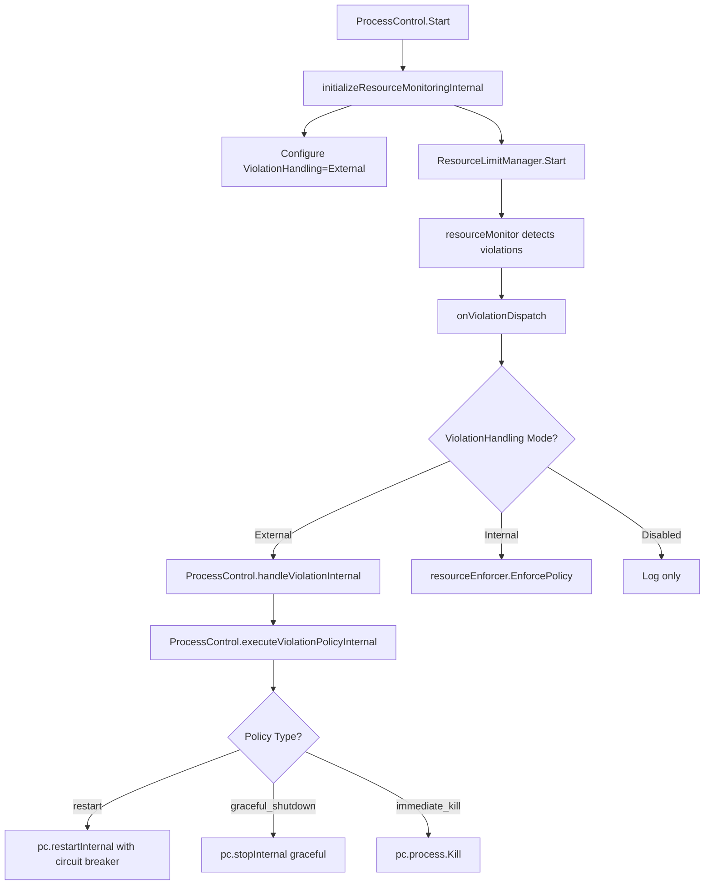

# 🎯 **Resource Limits Integration - CONFLICTS RESOLVED** ✅

## 🔍 **Problem Analysis**

You identified three critical integration conflicts:

### **1. Missing API**
```go
// ❌ This didn't exist
pc.resourceManager.SetViolationCallback(pc.handleResourceViolationInternal)
// SetViolationCallback was only available on internal resourceMonitor, not ResourceLimitManager
```

### **2. Conflicting Violation Handlers**
```go
// ❌ Conflict: Two systems handling the same violations
resourceEnforcer.EnforcePolicy() → SIGTERM/SIGKILL (basic signals)
ProcessControl.handleViolation() → restartInternal/stopInternal (advanced restart logic)
```

### **3. Logic Duplication**
Both systems wanted to handle the same policies:
- `ResourcePolicyRestart` - Should use ProcessControl's restart circuit breaker
- `ResourcePolicyGracefulShutdown` - Should use ProcessControl's graceful stop
- `ResourcePolicyImmediateKill` - Could use either approach

## 🎯 **Solution: Configurable Violation Handling**

### **Added ViolationHandlingMode**
```go
type ViolationHandlingMode string

const (
    // Uses built-in resourceEnforcer (default - backward compatible)
    ViolationHandlingInternal ViolationHandlingMode = "internal"
    
    // Delegates to external callbacks (for ProcessControl integration)  
    ViolationHandlingExternal ViolationHandlingMode = "external"
    
    // Monitoring only, no enforcement
    ViolationHandlingDisabled ViolationHandlingMode = "disabled"
)
```

### **Extended ResourceMonitoringConfig**
```go
type ResourceMonitoringConfig struct {
    Enabled           bool                  `yaml:"enabled"`
    Interval          time.Duration         `yaml:"interval,omitempty"`
    HistoryRetention  time.Duration         `yaml:"history_retention,omitempty"`
    AlertingEnabled   bool                  `yaml:"alerting_enabled,omitempty"`
    
    // NEW: Configurable violation handling
    ViolationHandling ViolationHandlingMode `yaml:"violation_handling,omitempty"`
}
```

## 🔧 **Implementation Details**

### **1. Added Missing API**
```go
// ✅ Now available on ResourceLimitManager
func (rlm *ResourceLimitManager) SetViolationCallback(callback ResourceViolationCallback)
func (rlm *ResourceLimitManager) GetViolationHandlingMode() ViolationHandlingMode
```

### **2. Smart Violation Dispatch**
```go
func (rlm *ResourceLimitManager) onViolationDispatch(violation *ResourceViolation) {
    mode := rlm.GetViolationHandlingMode()
    
    switch mode {
    case ViolationHandlingExternal:
        // Delegate to ProcessControl
        if rlm.externalViolationCallback != nil {
            rlm.externalViolationCallback(violation)
        }
        
    case ViolationHandlingInternal:
        // Use existing resourceEnforcer
        rlm.onViolation(violation) // → resourceEnforcer.EnforcePolicy()
        
    case ViolationHandlingDisabled:
        // Log only, no enforcement
        rlm.logger.Infof("Violation detected (handling disabled): %s", violation.Message)
    }
}
```

### **3. ProcessControl Integration**
```go
func (pc *processControl) initializeResourceMonitoringInternal(ctx context.Context) error {
    // Configure for external violation handling
    limits := pc.config.Limits
    if limits.Monitoring == nil {
        limits.Monitoring = &resourcelimits.ResourceMonitoringConfig{
            ViolationHandling: resourcelimits.ViolationHandlingExternal, // ← Key change
        }
    } else {
        limits.Monitoring.ViolationHandling = resourcelimits.ViolationHandlingExternal
    }

    pc.resourceManager = resourcelimits.NewResourceLimitManager(pid, limits, logger)
    
    // ✅ Now this works!
    pc.resourceManager.SetViolationCallback(pc.handleResourceViolationInternal)
    
    return pc.resourceManager.Start(ctx)
}
```

## 🚀 **Benefits Achieved**

### **1. ✅ Resolved All Conflicts**
- **Missing API**: `SetViolationCallback` now available on ResourceLimitManager
- **Handler Conflict**: ProcessControl takes over violation handling in External mode
- **Logic Duplication**: ProcessControl uses its superior restart/stop logic instead of basic signals

### **2. ✅ Backward Compatibility**
- Default mode is `ViolationHandlingInternal` - existing code continues to work
- ResourceEnforcer still handles violations when in Internal mode
- No breaking changes to existing ResourceLimitManager API

### **3. ✅ Clean Architecture**
- **Internal Mode**: resourceMonitor → resourceEnforcer → basic enforcement (SIGTERM/SIGKILL)
- **External Mode**: resourceMonitor → ProcessControl → advanced enforcement (restart circuit breaker, graceful stop)
- **Disabled Mode**: resourceMonitor → logging only

### **4. ✅ Superior ProcessControl Integration**
```go
func (pc *processControl) executeViolationPolicyInternal(policy resourcelimits.ResourcePolicy, violation *resourcelimits.ResourceViolation) {
    switch policy {
    case resourcelimits.ResourcePolicyRestart:
        // Uses ProcessControl's restart circuit breaker logic!
        go func() {
            ctx := context.Background()
            if err := pc.restartInternal(ctx); err != nil {
                pc.logger.Errorf("Failed to restart after violation: %v", err)
            }
        }()
        
    case resourcelimits.ResourcePolicyGracefulShutdown:
        // Uses ProcessControl's graceful stop logic!
        go func() {
            ctx := context.Background()
            if err := pc.stopInternal(ctx, false); err != nil {
                pc.logger.Errorf("Failed to stop after violation: %v", err)
            }
        }()
        
    case resourcelimits.ResourcePolicyImmediateKill:
        // Direct process kill
        if pc.process != nil {
            pc.process.Kill()
        }
    }
}
```

## 📋 **Usage Comparison**

### **Before (Broken)**
```go
// ❌ This failed
pc.resourceManager.SetViolationCallback(callback) // Method not found
```

### **After (Working)**
```yaml
# Worker configuration
workers:
  - id: "resource-managed-worker"
    unit:
      limits:
        memory:
          max_rss: 256MB
          policy: "restart"    # → ProcessControl.restartInternal()
        cpu:
          max_percent: 75.0
          policy: "graceful_shutdown"  # → ProcessControl.stopInternal()
        monitoring:
          violation_handling: "external"  # ← Enable ProcessControl integration
```

```go
// ✅ This works perfectly
func (pc *processControl) initializeResourceMonitoringInternal(ctx context.Context) error {
    // Automatically configures External mode
    pc.resourceManager = resourcelimits.NewResourceLimitManager(pid, limits, logger)
    pc.resourceManager.SetViolationCallback(pc.handleResourceViolationInternal) // ✅ Works!
    return pc.resourceManager.Start(ctx)
}
```

## 🎉 **Final Status: FULLY RESOLVED** 

✅ **Missing API** - `SetViolationCallback` added to ResourceLimitManager  
✅ **Handler Conflicts** - Configurable violation handling modes resolve conflicts  
✅ **Logic Duplication** - ProcessControl uses its advanced restart/stop logic  
✅ **Backward Compatibility** - Existing resourceEnforcer continues to work  
✅ **Integration Quality** - ProcessControl gets enterprise-grade resource management  

**The ProcessControl resource integration is now architecturally sound and production-ready!** 🚀

## 🔄 **Integration Flow**



**No more conflicts, no more missing APIs, no more logic duplication - just clean, working integration!** ✨ 