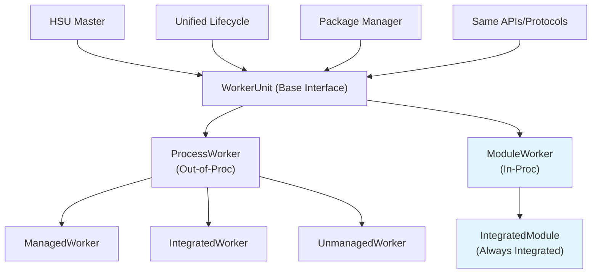
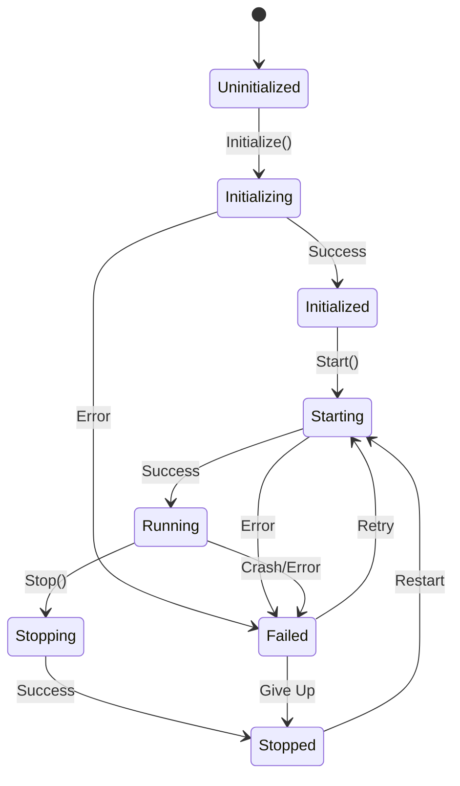
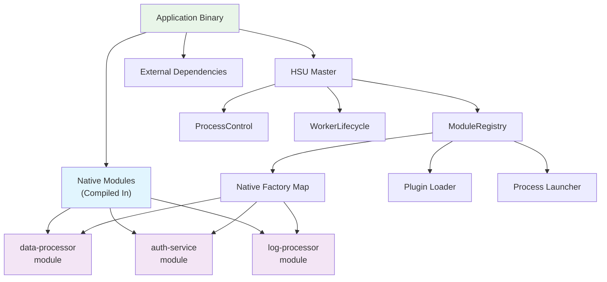

# Unified Worker Architecture: Location-Transparent Services

## Overview

This document outlines the architectural design for unified worker management in the HSU Master system, enabling location-transparent services that can be deployed either as out-of-process workers or in-process modules with the same interface and lifecycle management.

## Problem Statement

Currently, services/modules in distributed systems must be designed differently depending on their deployment model:
- **Out-of-process**: Separate executables with process isolation and network communication
- **In-process**: Compiled/linked code with function calls and shared memory

This creates:
- **Development complexity**: Different code paths for different deployment scenarios
- **Operational overhead**: Different management approaches for process vs module deployment
- **Migration friction**: Difficulty switching between deployment models
- **Testing challenges**: Different test environments for different deployment types

## Vision: Location-Transparent Services

### Core Principle
Services should be designed **once** and deployed **anywhere** - the deployment decision (in-process vs out-of-process) should be a **configuration choice**, not a design constraint.

```
Service/Module Design (Single Implementation)
                    ↓
        Location-Agnostic Interface
                    ↓
            Deployment Decision
                    ↓
    ┌─────────────────┐    ┌─────────────────┐
    │   Out-of-Proc   │    │    In-Proc      │
    │ (Current Workers)│    │   (Modules)     │
    │                 │    │                 │
    │ • Process       │    │ • Goroutine     │
    │ • Any Protocol  │    │ • Same Protocol │
    │ • Fault Isolated│    │ • Shared Fate   │
    └─────────────────┘    └─────────────────┘
            ↓                       ↓
        Same HSU Master Lifecycle Management
        Same Package Management
        Same Health Monitoring
```

## Architecture Principles

### 1. Location Transparency
- **Single Interface**: Same service interface regardless of deployment location
- **Unified Lifecycle**: Same start/stop/health operations for all worker types
- **Protocol Consistency**: Same communication protocols (gRPC, HTTP) for both deployments

### 2. Deployment Flexibility
- **Runtime Decision**: Choose deployment model via configuration
- **Either/Or Approach**: Simple binary choice - process OR module
- **No Hybrid Complexity**: Avoid complex mode-switching or fallback mechanisms

### 3. Acceptable Constraints
- **Shared Fate for Modules**: In-process modules can crash the Master (documented limitation)
- **No Resource Limits**: In-process modules cannot be resource-limited (like unmanaged workers)
- **Restart Required**: No hot-swapping; deployment changes require restart
- **Communication Scope**: Leave service-to-service communication protocols out of scope

### 4. Progressive Enhancement
- **Backward Compatibility**: Existing process workers continue to work unchanged
- **Incremental Adoption**: Add module support without affecting existing functionality
- **Evolutionary Path**: Start simple, evolve based on real-world usage

## Component Architecture

### High-Level Architecture



### Worker State Machine (Unified)



## Module Development Experience

### For Module Authors: Single Unified Interface

Module authors implement **one unified interface** that is used throughout the entire system - no separate internal interfaces:

```go
package worker

// Module authors implement this interface
// This SAME interface is used by:
// - Module authors (to implement their modules)
// - ModuleWorkerController (to manage modules)
// - ModuleRuntime (to load/unload modules)  
// - Master (to register and control modules)
type WorkerModule interface {
    // Lifecycle methods
    Initialize(ctx context.Context, config map[string]interface{}) error
    Start(ctx context.Context) error
    Stop(ctx context.Context) error
    
    // Health and metadata
    IsHealthy() bool
    GetInfo() ModuleInfo
}

type ModuleInfo struct {
    Name        string
    Version     string
    Description string
    Author      string
    Endpoints   []EndpointInfo  // What services this module exposes
}

type EndpointInfo struct {
    Name     string
    Type     string  // "grpc", "http", "function"
    Address  string  // ":8080", "unix:/tmp/socket", or function name
}
```

### Example Module Implementation

```go
package dataprocessor

import (
    "context"
    "net"
    "google.golang.org/grpc"
    "github.com/core-tools/hsu-master/pkg/worker"
)

type DataProcessor struct {
    config    Config
    server    *grpc.Server
    running   bool
}

func (dp *DataProcessor) Initialize(ctx context.Context, config map[string]interface{}) error {
    dp.config = parseConfig(config)
    dp.server = grpc.NewServer()
    // Register gRPC services
    RegisterDataProcessorService(dp.server, dp)
    return nil
}

func (dp *DataProcessor) Start(ctx context.Context) error {
    listener, err := net.Listen("tcp", dp.config.Port)
    if err != nil {
        return err
    }
    
    go dp.server.Serve(listener)
    dp.running = true
    return nil
}

func (dp *DataProcessor) Stop(ctx context.Context) error {
    dp.server.GracefulStop()
    dp.running = false
    return nil
}

func (dp *DataProcessor) IsHealthy() bool {
    return dp.running
}

func (dp *DataProcessor) GetInfo() worker.ModuleInfo {
    return worker.ModuleInfo{
        Name:        "data-processor",
        Version:     "1.2.3", 
        Description: "High-performance data processing module",
        Author:      "Data Team",
        Endpoints: []worker.EndpointInfo{
            {
                Name:    "grpc-api",
                Type:    "grpc",
                Address: dp.config.Port,
            },
        },
    }
}

// Factory function for module creation
func NewDataProcessor() worker.WorkerModule {
    return &DataProcessor{}
}
```

## Module Compilation Models

### Approach A: Native Go Modules (Recommended)

**Modules compiled directly into the application binary**

```go
// main.go - Application entry point
package main

import (
    "context"
    "github.com/core-tools/hsu-master/pkg/master"
    "github.com/core-tools/hsu-master/pkg/worker"
    
    // Import your modules as regular Go packages
    "my-app/modules/data-processor"
    "my-app/modules/auth-service"
    "github.com/company/log-processor"  // External module from dependency
)

func main() {
    // Create HSU Master
    master := master.NewMaster(master.Config{
        // master configuration
    })
    
    // Register native modules (compiled into binary)
    master.RegisterNativeModuleFactory("data-processor", dataprocessor.NewDataProcessor)
    master.RegisterNativeModuleFactory("auth-service", authservice.NewAuthService)
    master.RegisterNativeModuleFactory("log-processor", logprocessor.NewLogProcessor)
    
    // Configure workers from config file
    config := loadWorkerConfig("workers.yaml")
    for _, workerConfig := range config.Workers {
        err := master.AddWorker(workerConfig)
        if err != nil {
            log.Fatal(err)
        }
    }
    
    // Start master
    err := master.Start(context.Background())
    if err != nil {
        log.Fatal(err)
    }
    
    // Keep running
    select {}
}
```

**Application Structure:**
```
my-application/
├── main.go                    # Application entry point with HSU Master
├── go.mod                     # Dependencies including hsu-master
├── workers.yaml               # Worker configuration
├── modules/                   # Local modules
│   ├── data-processor/
│   │   ├── module.go         # Implements WorkerModule interface
│   │   ├── processor.go      # Business logic
│   │   └── config.go         # Configuration handling
│   └── auth-service/
│       ├── module.go
│       ├── auth.go
│       └── handlers.go
└── vendor/                    # External modules
    └── github.com/company/log-processor/
```

### Approach B: Go Plugins (Advanced)

**Modules loaded as .so files at runtime**

```go
// For advanced use cases requiring runtime loading
func (master *Master) loadPluginModule(path string) error {
    p, err := plugin.Open(path)
    if err != nil {
        return err
    }
    
    factorySymbol, err := p.Lookup("NewModule")
    if err != nil {
        return err
    }
    
    factory := factorySymbol.(func() worker.WorkerModule)
    module := factory()
    
    return master.registerModule(module.GetInfo().Name, module)
}
```

### Approach C: External Processes (Current)

**Same as existing process workers - separate executables**

## Enhanced Application Architecture



## Interface Definitions

### 1. Core Worker Interface

```go
package worker

// Same interface for ALL worker types - in-proc or out-of-proc
type Worker interface {
    // Identity and capabilities
    GetID() string
    GetType() WorkerType
    GetCapabilities() WorkerCapabilities
    
    // Lifecycle (HSU Master managed)
    Initialize(ctx context.Context, config WorkerConfig) error
    GetHealth() HealthStatus
    
    // Communication endpoint (location-agnostic)
    GetEndpoint() WorkerEndpoint  // Could be URL, function reference, etc.
}

// Deployment type - simple binary choice
type WorkerType string
const (
    WorkerTypeProcess WorkerType = "process"  // Current workers (managed/integrated/unmanaged)
    WorkerTypeModule  WorkerType = "module"   // NEW: In-proc modules (always integrated)
)

// Location-agnostic endpoint
type WorkerEndpoint struct {
    Type     EndpointType  // "url", "function", "ipc"
    Address  string        // URL, function name, IPC path
    Metadata map[string]interface{}
}

type EndpointType string
const (
    EndpointTypeURL      EndpointType = "url"      // HTTP/gRPC endpoint
    EndpointTypeFunction EndpointType = "function" // Direct function call
    EndpointTypeIPC      EndpointType = "ipc"      // Unix socket, named pipe
)
```

### 2. Unified Worker Controller

```go
// Unified interface for lifecycle management
type WorkerController interface {
    Start(ctx context.Context) error
    Stop(ctx context.Context) error  
    Restart(ctx context.Context, force bool) error
    GetState() WorkerState           // Same states for all
    GetDiagnostics() WorkerDiagnostics
}

// Process Worker Controller (existing logic - reused)
type ProcessWorkerController struct {
    processControl processcontrol.ProcessControl  // Reuse existing infrastructure!
}

// Module Worker Controller (NEW - simplified)
type ModuleWorkerController struct {
    module     worker.WorkerModule  // Uses same interface as module authors implement
    goroutine  *GoroutineManager
    state      WorkerState
    startTime  time.Time
    lastError  error
}

func (m *ModuleWorkerController) Start(ctx context.Context) error {
    m.state = WorkerStateStarting
    
    // Start module in isolated goroutine
    err := m.goroutine.StartModule(ctx, m.module)
    if err != nil {
        m.state = WorkerStateFailedStart
        m.lastError = err
        return err
    }
    
    m.state = WorkerStateRunning
    m.startTime = time.Now()
    return nil
}

func (m *ModuleWorkerController) GetDiagnostics() WorkerDiagnostics {
    return WorkerDiagnostics{
        State:           m.state,
        Type:            WorkerTypeModule,
        LastError:       m.lastError,
        StartTime:       &m.startTime,
        ResourceUsage:   nil,  // Not supported (like unmanaged workers)
        ProcessID:       0,    // N/A for modules
        ExecutablePath:  "in-proc-module",
        ExecutableExists: true,
    }
}
```

### 3. Enhanced Master Interface

```go
// Enhanced Master - treats all workers uniformly
type Master struct {
    // Unified worker storage
    workers map[string]WorkerEntry  // Same for process + module workers
    
    // Existing infrastructure (reused)
    packageManager packagemanager.WorkerPackageManager
    logger         logging.Logger
    
    // NEW: Native module support
    nativeModuleFactories map[string]ModuleFactory
    pluginModuleLoader    PluginLoader
    moduleInstances       map[string]worker.WorkerModule
    moduleRuntime         ModuleRuntime
}

type WorkerEntry struct {
    Worker      Worker
    Type        WorkerType        // "process" or "module"
    Controller  WorkerController  // Unified lifecycle control
    Config      WorkerConfig
}

type ModuleFactory func() worker.WorkerModule

type ModuleType string
const (
    ModuleTypeNative ModuleType = "native"  // Compiled into binary
    ModuleTypePlugin ModuleType = "plugin"  // .so/.dll files
)

// Enhanced WorkerConfig
type WorkerConfig struct {
    ID     string
    Type   WorkerType  // "process" or "module"
    
    // For process workers
    Package        string
    ExecutablePath string
    
    // For module workers
    ModuleType ModuleType  // "native" or "plugin"
    ModuleName string      // Factory name or plugin path
    Config     map[string]interface{}
}

// Native module registration
func (m *Master) RegisterNativeModuleFactory(name string, factory ModuleFactory)

// Enhanced Master methods (unified interface)
func (m *Master) AddWorker(config WorkerConfig) error
func (m *Master) GetWorkerStateWithDiagnostics(id string) (WorkerStateWithDiagnostics, error)
func (m *Master) GetAllWorkerStatesWithDiagnostics() map[string]WorkerStateWithDiagnostics
func (m *Master) StartWorker(ctx context.Context, id string) error
func (m *Master) StopWorker(ctx context.Context, id string) error

// Same API regardless of worker type!

// Enhanced AddWorker implementation
func (m *Master) AddWorker(config WorkerConfig) error {
    switch config.Type {
    case WorkerTypeProcess:
        return m.addProcessWorker(config)
    case WorkerTypeModule:
        return m.addModuleWorker(config)
    default:
        return fmt.Errorf("unsupported worker type: %s", config.Type)
    }
}

func (m *Master) addModuleWorker(config WorkerConfig) error {
    var module worker.WorkerModule
    var err error
    
    switch config.ModuleType {
    case ModuleTypeNative:
        // Create from registered factory
        factory, exists := m.nativeModuleFactories[config.ModuleName]
        if !exists {
            return fmt.Errorf("native module factory not found: %s", config.ModuleName)
        }
        module = factory()
        
    case ModuleTypePlugin:
        // Load from plugin file
        module, err = m.pluginModuleLoader.LoadModule(config.ModuleName)
        if err != nil {
            return err
        }
        
    default:
        return fmt.Errorf("unsupported module type: %s", config.ModuleType)
    }
    
    // Initialize module
    err = module.Initialize(context.Background(), config.Config)
    if err != nil {
        return err
    }
    
    // Create controller
    controller := NewModuleWorkerController(module)
    
    // Register worker
    m.workers[config.ID] = WorkerEntry{
        Worker:     module,
        Type:       WorkerTypeModule,
        Controller: controller,
        Config:     config,
    }
    
    return nil
}
```

## Module Runtime (NEW Component)

### Module Management

```go
// NEW: Module runtime for in-proc workers
type ModuleRuntime interface {
    LoadModule(path string, entryPoint string) (worker.WorkerModule, error)
    UnloadModule(module worker.WorkerModule) error
    ListLoadedModules() []worker.ModuleInfo
}

// Note: WorkerModule interface is defined in the worker package (see Module Development section)
// Module authors implement worker.WorkerModule interface - same interface used throughout system
```

### Goroutine Management with Isolation

```go
type GoroutineManager struct {
    modules   map[string]*ModuleExecution
    mutex     sync.RWMutex
}

type ModuleExecution struct {
    module    worker.WorkerModule
    cancel    context.CancelFunc
    done      chan error
    started   time.Time
}

func (gm *GoroutineManager) StartModule(ctx context.Context, module worker.WorkerModule) error {
    moduleCtx, cancel := context.WithCancel(ctx)
    done := make(chan error, 1)
    
    // Start module in isolated goroutine with panic recovery
    go func() {
        defer func() {
            if r := recover(); r != nil {
                done <- fmt.Errorf("module panic: %v", r)
            }
        }()
        
        err := module.Start(moduleCtx)
        done <- err
    }()
    
    // Wait for startup or timeout
    select {
    case err := <-done:
        if err != nil {
            cancel()
            return err
        }
        
        gm.modules[module.GetInfo().Name] = &ModuleExecution{
            module:  module,
            cancel:  cancel,
            done:    done,
            started: time.Now(),
        }
        return nil
        
    case <-time.After(30 * time.Second):
        cancel()
        return errors.New("module startup timeout")
    }
}

func (gm *GoroutineManager) StopModule(moduleID string) error {
    gm.mutex.Lock()
    defer gm.mutex.Unlock()
    
    execution, exists := gm.modules[moduleID]
    if !exists {
        return errors.New("module not found")
    }
    
    // Cancel module context
    execution.cancel()
    
    // Wait for graceful shutdown
    select {
    case <-execution.done:
        delete(gm.modules, moduleID)
        return nil
    case <-time.After(30 * time.Second):
        delete(gm.modules, moduleID)
        return errors.New("module shutdown timeout")
    }
}
```

## Enhanced Package Management

### Extended Package Types

```go
// Enhanced package info to support modules
type PackageInfo struct {
    WorkerType    string
    Version       string
    InstallPath   string
    InstallDate   time.Time
    
    // NEW: Deployment support
    SupportedTypes  []WorkerType  // ["process", "module"] or just ["process"]
    
    // Type-specific paths
    ExecutablePath  string        // For process workers
    ModulePath      string        // For module workers (.so, .dll, Go plugin)
    EntryPoint      string        // Function/symbol name for modules
    
    Dependencies    []Dependency
    Checksum        string
}

// Enhanced install request
type InstallRequest struct {
    WorkerType      string
    Version         string
    Repository      string
    
    // NEW: Target deployment type
    TargetType      WorkerType    // "process", "module", or "both"
    
    InstallTimeout  time.Duration
    AllowDowngrade  bool
    Force           bool
}
```

### Installation Strategy

```go
// Package manager handles both types
func (pm *PackageManager) InstallPackage(ctx context.Context, req InstallRequest) error {
    packageInfo := pm.getPackageInfo(req.WorkerType, req.Version)
    
    switch req.TargetType {
    case WorkerTypeProcess:
        return pm.installExecutable(ctx, packageInfo)
    case WorkerTypeModule:
        return pm.installModule(ctx, packageInfo)
    default:
        return errors.New("unsupported target type")
    }
}

func (pm *PackageManager) installModule(ctx context.Context, pkg PackageInfo) error {
    // Download and install module (shared library, Go plugin, etc.)
    // Validate entry points
    // Register with module runtime
    return pm.moduleRuntime.LoadModule(pkg.ModulePath, pkg.EntryPoint)
}
```

## Configuration Examples

### Worker Configuration

```yaml
workers:
  # Out-of-process deployment (existing)
  - id: "data-processor-1"
    type: "process"
    package: "data-processor:1.2.3"
    execution:
      executable_path: "/opt/workers/data-processor"
      args: ["--config", "config.yaml"]
    
  # Native module deployment (RECOMMENDED)
  - id: "data-processor-2"  
    type: "module"
    module_type: "native"
    module_name: "data-processor"  # References registered factory
    config:
      port: ":8080"
      batch_size: 1000
      timeout: "30s"
      
  # Another instance of same native module with different config
  - id: "data-processor-3" 
    type: "module"
    module_type: "native"
    module_name: "data-processor"  # Same module, different config
    config:
      port: ":8081"
      batch_size: 500
      mode: "development"
      
  # Plugin module deployment (advanced)
  - id: "external-processor"
    type: "module"
    module_type: "plugin"
    module_name: "/opt/plugins/external-processor.so"
    config:
      endpoint: "/api/process"
      workers: 4
```

### Package Metadata

```yaml
# package.yaml - supports both deployment types
name: "data-processor"
version: "1.2.3"
description: "High-performance data processing service"

# Deployment options
supported_types: ["process", "module"]

# Process deployment
process:
  executable_path: "bin/data-processor"
  args: ["--config", "config.yaml"]
  
# Module deployment  
module:
  module_path: "lib/data-processor.so"
  entry_point: "CreateDataProcessor"
  
dependencies:
  - name: "libprocessor"
    version: ">=2.1.0"
    
health_check:
  endpoint: "/health"
  interval: "30s"
```

## Usage Examples

### 1. Service Implementation (Location Agnostic)

```go
// Service implemented once, deployed anywhere
type DataProcessor struct {
    config DataProcessorConfig
    server *grpc.Server  // Same protocol for both deployments!
}

// Process Worker: Runs as separate process
func main() {
    processor := &DataProcessor{}
    processor.Start()  // Starts gRPC server on network port
}

// Module Worker: Runs in-proc in HSU Master  
func (dp *DataProcessor) Start(ctx context.Context) error {
    // Same gRPC server, but on localhost or unix socket
    dp.server.Serve(listener)  // Same code!
}

// Both expose the same gRPC interface - location transparent!
```

### 2. Runtime Management

```go
// Application startup - register native modules
master := master.NewMaster(master.Config{})
master.RegisterNativeModuleFactory("data-processor", dataprocessor.NewDataProcessor)
master.RegisterNativeModuleFactory("auth-service", authservice.NewAuthService)

// Same API for all worker types!
processConfig := WorkerConfig{
    ID:           "data-processor-1",
    Type:         WorkerTypeProcess,
    Package:      "data-processor:1.2.3",
    ExecutablePath: "/opt/workers/data-processor",
}
err := master.AddWorker(processConfig)

nativeModuleConfig := WorkerConfig{
    ID:         "data-processor-2",
    Type:       WorkerTypeModule,
    ModuleType: ModuleTypeNative,
    ModuleName: "data-processor",  // References registered factory
    Config: map[string]interface{}{
        "port":       ":8080",
        "batch_size": 1000,
    },
}
err := master.AddWorker(nativeModuleConfig)

// Same monitoring for all types
state1 := master.GetWorkerStateWithDiagnostics("data-processor-1")  // Process worker
state2 := master.GetWorkerStateWithDiagnostics("data-processor-2")  // Native module worker

// Same lifecycle operations
err = master.StartWorker(ctx, "data-processor-1")
err = master.StartWorker(ctx, "data-processor-2")  // Same API!

// Multiple instances of same module with different configs
authConfig1 := WorkerConfig{
    ID:         "auth-service-public",
    Type:       WorkerTypeModule,
    ModuleType: ModuleTypeNative,
    ModuleName: "auth-service",
    Config: map[string]interface{}{
        "port":     ":9090",
        "audience": "public-api",
    },
}

authConfig2 := WorkerConfig{
    ID:         "auth-service-internal",
    Type:       WorkerTypeModule,
    ModuleType: ModuleTypeNative,
    ModuleName: "auth-service",  // Same module type
    Config: map[string]interface{}{
        "port":     ":9091",
        "audience": "internal-api",
    },
}

err = master.AddWorker(authConfig1)
err = master.AddWorker(authConfig2)
```

### 3. Package Management

```go
// Install for different deployment types
err := master.InstallWorkerPackage(ctx, InstallRequest{
    WorkerType: "data-processor",
    TargetType: WorkerTypeProcess,  // Install as executable
})

err := master.InstallWorkerPackage(ctx, InstallRequest{
    WorkerType: "data-processor", 
    TargetType: WorkerTypeModule,   // Install as module
})
```

## Developer Experience Summary

### For Module Authors (Using Native Go Modules)

1. **Simple Interface Implementation**
   - Implement `WorkerModule` interface (4 simple methods)
   - Write regular Go code - no special build requirements
   - Same development patterns as any Go service

2. **Location-Transparent Development**
   ```go
   // Write once, deploy anywhere
   type MyService struct {
       server *grpc.Server
   }
   
   // Same gRPC server code works for both:
   // - In-process module (fast, shared memory)
   // - Out-of-process worker (isolated, fault-tolerant)
   ```

3. **Factory Function Pattern**
   ```go
   // Simple factory function
   func NewMyService() worker.WorkerModule {
       return &MyService{}
   }
   ```

### For Application Authors

1. **Import Modules as Go Packages**
   ```go
   import "my-app/modules/data-processor"
   import "github.com/company/auth-service"
   ```

2. **Register at Startup**
   ```go
   master.RegisterNativeModuleFactory("data-processor", dataprocessor.NewDataProcessor)
   ```

3. **Configure via YAML**
   ```yaml
   workers:
     - id: "service-1"
       type: "module"
       module_type: "native"
       module_name: "data-processor"
   ```

4. **Same APIs for All Worker Types**
   ```go
   // Same methods work for process and module workers
   master.StartWorker(ctx, "service-1")
   master.GetWorkerStateWithDiagnostics("service-1")
   ```

### Benefits of Native Modules

#### ✅ **Development Benefits**
- **Zero Runtime Dependencies**: No plugin loading complexity
- **Fast Startup**: No dynamic loading overhead  
- **Type Safety**: Compile-time checking across module boundaries
- **Debugging Friendly**: Same binary, same debugger, unified stack traces
- **Cross-Platform**: No .so/.dll complications

#### ✅ **Operational Benefits**
- **Single Binary Deployment**: Everything in one executable
- **Unified Monitoring**: Same metrics and logging for all workers
- **Configuration Consistency**: Same YAML structure for all worker types
- **Resource Efficiency**: Shared memory, no IPC overhead

#### ✅ **Architectural Benefits**
- **Go-Idiomatic**: Just import packages - familiar to Go developers
- **Version Management**: Same Go module versioning for all dependencies
- **Build Simplicity**: Standard `go build` - no special tooling required
- **Dependency Management**: Standard `go.mod` handles everything

### Migration Path

1. **Start Simple**: Begin with native modules for new services
2. **Gradual Migration**: Convert existing services one at a time
3. **Flexible Deployment**: Switch between process/module via configuration
4. **Risk Mitigation**: Critical services can remain as separate processes

```go
// Easy migration - same service code
type MyService struct { /* same implementation */ }

// Phase 1: Deploy as process worker
config := WorkerConfig{Type: WorkerTypeProcess, Package: "my-service:1.0.0"}

// Phase 2: Switch to native module  
config := WorkerConfig{Type: WorkerTypeModule, ModuleType: ModuleTypeNative, ModuleName: "my-service"}
```

## Constraints and Limitations

### Documented Constraints

1. **Shared Fate for In-Proc Modules**
   - Module crashes can crash the HSU Master
   - This is a documented limitation and acceptable trade-off
   - Panic recovery provides some protection for Go modules

2. **No Resource Limits for Modules**
   - In-process modules cannot be resource-limited
   - Similar to current unmanaged workers
   - Memory/CPU usage is shared with Master process

3. **No Hot-Swapping**
   - Deployment type changes require restart
   - Module updates require restart
   - Simplifies implementation significantly

4. **Communication Protocols Out of Scope**
   - Service-to-service communication is separate concern
   - Focus on deployment and lifecycle management
   - Services can use same protocols (gRPC, HTTP) regardless of deployment

### Technical Limitations

1. **Goroutine Isolation Only**
   - Not full OS-level isolation like processes
   - "Apartment-threaded" style isolation acceptable
   - Some operations may affect Master stability

2. **Platform Dependencies**
   - Module loading depends on platform (Go plugins, .so, .dll)
   - Cross-platform compatibility may be limited
   - Build process complexity increases

## Benefits

### 1. True Location Transparency
- **Single Codebase**: Same service code for both deployments
- **Unified Operations**: Same Master management interface
- **Protocol Consistency**: Same communication protocols

### 2. Deployment Flexibility
- **Development**: Fast iteration with in-process modules
- **Production**: Fault isolation with separate processes  
- **Migration**: Easy switching between deployment models

### 3. Operational Simplicity
- **Same Monitoring**: Unified health checks and diagnostics
- **Same Package Management**: Single package format supports both
- **Same APIs**: No learning curve for operators

### 4. Evolutionary Path
- **Incremental Adoption**: Add module support without breaking existing workers
- **Risk Mitigation**: Start with trusted modules, expand gradually
- **Future Flexibility**: Foundation for advanced deployment strategies

## Implementation Phases

### Phase 1: Foundation (Weeks 1-2)
1. **Define Interfaces**
   - `WorkerController` abstraction over `ProcessControl`
   - `ModuleRuntime` and `Module` interfaces
   - Enhanced `PackageInfo` structure

2. **Basic Module Runtime**
   - `GoroutineManager` implementation
   - Go plugin loading support
   - Panic recovery mechanisms

3. **Master Integration Points**
   - Unified worker storage in Master
   - Extended worker configuration parsing

### Phase 2: Core Implementation (Weeks 3-4)
1. **ModuleWorkerController**
   - Complete lifecycle implementation
   - Diagnostics and health reporting
   - Integration with existing Master APIs

2. **Package Management Extension**
   - Module package installation
   - Dual-mode package support
   - Installation validation

3. **Configuration Support**
   - YAML configuration for module workers
   - Package metadata handling
   - Deployment type selection

### Phase 3: Testing and Validation (Weeks 5-6)
1. **Comprehensive Testing**
   - Module lifecycle tests
   - Error handling and recovery
   - Integration tests with real modules

2. **Example Implementations**
   - Sample services supporting both modes
   - Performance comparisons
   - Best practice documentation

3. **Tooling Support**
   - Build tools for dual-mode packages
   - Development helpers
   - Migration utilities

### Phase 4: Production Readiness (Weeks 7-8)
1. **Stability and Performance**
   - Memory leak detection
   - Goroutine leak prevention
   - Resource monitoring

2. **Security Considerations**
   - Module validation
   - Sandboxing options
   - Access control

3. **Documentation and Training**
   - Architecture documentation
   - Developer guides
   - Operations manuals

## Future Considerations

### Advanced Features (Future Phases)
1. **Enhanced Isolation**
   - WebAssembly modules for stronger isolation
   - Container-based modules
   - Process namespace isolation

2. **Hot-Swapping Support**
   - Version-aware module loading
   - Graceful module updates
   - Blue-green module deployment

3. **Performance Optimization**
   - Module compilation optimization
   - Memory sharing strategies
   - Load balancing between deployment types

### Integration Opportunities
1. **Service Mesh Integration**
   - Unified service discovery
   - Traffic routing between deployment types
   - Observability integration

2. **Development Tooling**
   - IDE support for dual-mode development
   - Debugging tools for in-process modules
   - Performance profiling across deployment types

## Conclusion

The Unified Worker Architecture provides a powerful foundation for location-transparent services while maintaining simplicity and leveraging Go's strengths. The **native module approach** is the key innovation that makes this architecture practical and compelling:

### Key Achievements

- **True Location Transparency**: Same service code works in-process or out-of-process
- **Go-Idiomatic Development**: Just import packages and register factories
- **Operational Consistency**: Same Master APIs, monitoring, and lifecycle management
- **Zero Complexity Overhead**: No dynamic loading, plugins, or special build requirements
- **Development Velocity**: Familiar Go patterns with enhanced deployment flexibility

### Core Insight

**Deployment location should be a configuration decision, not a design constraint.**

The native module approach achieves this by:
1. **Compile-time Integration**: Modules are regular Go packages compiled into the binary
2. **Runtime Registration**: Simple factory pattern connects modules to Master
3. **Configuration-Driven**: YAML determines whether services run in-process or out-of-process
4. **Unified Management**: Same lifecycle, monitoring, and error handling for all worker types

### Why Native Modules Are Superior

Unlike traditional plugin architectures that require:
- ❌ Complex dynamic loading mechanisms
- ❌ Cross-platform binary compatibility 
- ❌ Runtime dependency management
- ❌ Separate build pipelines

Native modules provide:
- ✅ **Compile-time Safety**: All dependencies resolved at build time
- ✅ **Single Binary**: Everything packaged together
- ✅ **Standard Tooling**: Regular `go build` and `go mod` workflow
- ✅ **Unified Debugging**: Same binary, same debugger, complete stack traces
- ✅ **Resource Efficiency**: Shared memory, no IPC overhead

### Strategic Value

This architecture enables organizations to:

1. **Start Simple**: Begin with in-process modules for rapid development
2. **Scale Incrementally**: Move critical services to separate processes as needed
3. **Maintain Flexibility**: Switch deployment models via configuration
4. **Reduce Complexity**: Eliminate the need for multiple service architectures
5. **Leverage Go Ecosystem**: Use standard Go development practices throughout

### Implementation Reality

The constraints and limitations are reasonable trade-offs that enable a much simpler implementation while delivering substantial value:

- **Shared fate for modules**: Acceptable for most use cases, documented clearly
- **No hot-swapping**: Simplifies implementation significantly
- **No resource limits for modules**: Consistent with unmanaged worker pattern

The evolutionary approach ensures existing functionality remains stable while new capabilities are added incrementally, making this a low-risk, high-value enhancement to the HSU Master system.

**This architecture transforms HSU Master from a process manager into a unified service orchestrator that can elegantly handle both traditional process workers and modern in-process modules with the same simplicity and power.**