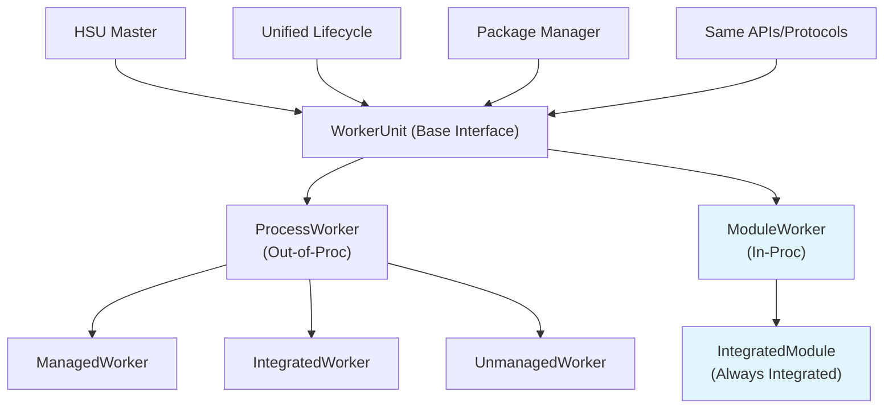
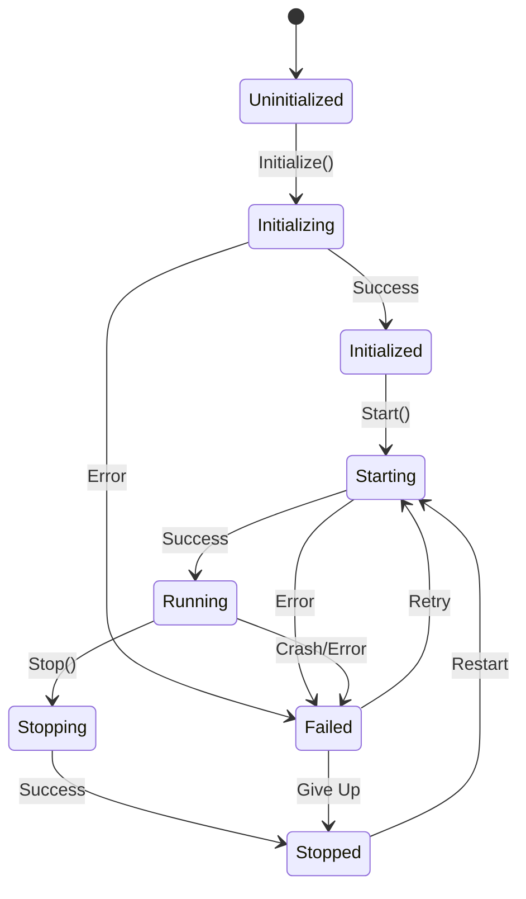

# Unified Worker Architecture: Location-Transparent Services

## Overview

This document outlines the architectural design for unified worker management in the HSU Master system, enabling location-transparent services that can be deployed either as out-of-process workers or in-process modules with the same interface and lifecycle management.

## Problem Statement

Currently, services/modules in distributed systems must be designed differently depending on their deployment model:
- **Out-of-process**: Separate executables with process isolation and network communication
- **In-process**: Compiled/linked code with function calls and shared memory

This creates:
- **Development complexity**: Different code paths for different deployment scenarios
- **Operational overhead**: Different management approaches for process vs module deployment
- **Migration friction**: Difficulty switching between deployment models
- **Testing challenges**: Different test environments for different deployment types

## Vision: Location-Transparent Services

### Core Principle
Services should be designed **once** and deployed **anywhere** - the deployment decision (in-process vs out-of-process) should be a **configuration choice**, not a design constraint.

```
Service/Module Design (Single Implementation)
                    ↓
        Location-Agnostic Interface
                    ↓
            Deployment Decision
                    ↓
    ┌─────────────────┐    ┌─────────────────┐
    │   Out-of-Proc   │    │    In-Proc      │
    │ (Current Workers)│    │   (Modules)     │
    │                 │    │                 │
    │ • Process       │    │ • Goroutine     │
    │ • Any Protocol  │    │ • Same Protocol │
    │ • Fault Isolated│    │ • Shared Fate   │
    └─────────────────┘    └─────────────────┘
            ↓                       ↓
        Same HSU Master Lifecycle Management
        Same Package Management
        Same Health Monitoring
```

## Architecture Principles

### 1. Location Transparency
- **Single Interface**: Same service interface regardless of deployment location
- **Unified Lifecycle**: Same start/stop/health operations for all worker types
- **Protocol Consistency**: Same communication protocols (gRPC, HTTP) for both deployments

### 2. Deployment Flexibility
- **Runtime Decision**: Choose deployment model via configuration
- **Either/Or Approach**: Simple binary choice - process OR module
- **No Hybrid Complexity**: Avoid complex mode-switching or fallback mechanisms

### 3. Acceptable Constraints
- **Shared Fate for Modules**: In-process modules can crash the Master (documented limitation)
- **No Resource Limits**: In-process modules cannot be resource-limited (like unmanaged workers)
- **Restart Required**: No hot-swapping; deployment changes require restart
- **Communication Scope**: Leave service-to-service communication protocols out of scope

### 4. Progressive Enhancement
- **Backward Compatibility**: Existing process workers continue to work unchanged
- **Incremental Adoption**: Add module support without affecting existing functionality
- **Evolutionary Path**: Start simple, evolve based on real-world usage

## Component Architecture

### High-Level Architecture



### Worker State Machine (Unified)



## Interface Definitions

### 1. Core Worker Interface

```go
package worker

// Same interface for ALL worker types - in-proc or out-of-proc
type Worker interface {
    // Identity and capabilities
    GetID() string
    GetType() WorkerType
    GetCapabilities() WorkerCapabilities
    
    // Lifecycle (HSU Master managed)
    Initialize(ctx context.Context, config WorkerConfig) error
    GetHealth() HealthStatus
    
    // Communication endpoint (location-agnostic)
    GetEndpoint() WorkerEndpoint  // Could be URL, function reference, etc.
}

// Deployment type - simple binary choice
type WorkerType string
const (
    WorkerTypeProcess WorkerType = "process"  // Current workers (managed/integrated/unmanaged)
    WorkerTypeModule  WorkerType = "module"   // NEW: In-proc modules (always integrated)
)

// Location-agnostic endpoint
type WorkerEndpoint struct {
    Type     EndpointType  // "url", "function", "ipc"
    Address  string        // URL, function name, IPC path
    Metadata map[string]interface{}
}

type EndpointType string
const (
    EndpointTypeURL      EndpointType = "url"      // HTTP/gRPC endpoint
    EndpointTypeFunction EndpointType = "function" // Direct function call
    EndpointTypeIPC      EndpointType = "ipc"      // Unix socket, named pipe
)
```

### 2. Unified Worker Controller

```go
// Unified interface for lifecycle management
type WorkerController interface {
    Start(ctx context.Context) error
    Stop(ctx context.Context) error  
    Restart(ctx context.Context, force bool) error
    GetState() WorkerState           // Same states for all
    GetDiagnostics() WorkerDiagnostics
}

// Process Worker Controller (existing logic - reused)
type ProcessWorkerController struct {
    processControl processcontrol.ProcessControl  // Reuse existing infrastructure!
}

// Module Worker Controller (NEW - simplified)
type ModuleWorkerController struct {
    module     Module
    goroutine  *GoroutineManager
    state      WorkerState
    startTime  time.Time
    lastError  error
}

func (m *ModuleWorkerController) Start(ctx context.Context) error {
    m.state = WorkerStateStarting
    
    // Start module in isolated goroutine
    err := m.goroutine.StartModule(ctx, m.module)
    if err != nil {
        m.state = WorkerStateFailedStart
        m.lastError = err
        return err
    }
    
    m.state = WorkerStateRunning
    m.startTime = time.Now()
    return nil
}

func (m *ModuleWorkerController) GetDiagnostics() WorkerDiagnostics {
    return WorkerDiagnostics{
        State:           m.state,
        Type:            WorkerTypeModule,
        LastError:       m.lastError,
        StartTime:       &m.startTime,
        ResourceUsage:   nil,  // Not supported (like unmanaged workers)
        ProcessID:       0,    // N/A for modules
        ExecutablePath:  "in-proc-module",
        ExecutableExists: true,
    }
}
```

### 3. Enhanced Master Interface

```go
// Enhanced Master - treats all workers uniformly
type Master struct {
    // Unified worker storage
    workers map[string]WorkerEntry  // Same for process + module workers
    
    // Existing infrastructure (reused)
    packageManager packagemanager.WorkerPackageManager
    logger         logging.Logger
    
    // NEW: Module runtime
    moduleRuntime  ModuleRuntime
}

type WorkerEntry struct {
    Worker      Worker
    Type        WorkerType        // "process" or "module"
    Controller  WorkerController  // Unified lifecycle control
    Config      WorkerConfig
}

// Enhanced Master methods (unified interface)
func (m *Master) AddWorker(config WorkerConfig) error
func (m *Master) GetWorkerStateWithDiagnostics(id string) (WorkerStateWithDiagnostics, error)
func (m *Master) GetAllWorkerStatesWithDiagnostics() map[string]WorkerStateWithDiagnostics
func (m *Master) StartWorker(ctx context.Context, id string) error
func (m *Master) StopWorker(ctx context.Context, id string) error

// Same API regardless of worker type!
```

## Module Runtime (NEW Component)

### Module Management

```go
// NEW: Module runtime for in-proc workers
type ModuleRuntime interface {
    LoadModule(path string, entryPoint string) (Module, error)
    UnloadModule(module Module) error
    ListLoadedModules() []ModuleInfo
}

type Module interface {
    // Module lifecycle (called by ModuleWorkerController)
    Initialize(ctx context.Context, config map[string]interface{}) error
    Start(ctx context.Context) error
    Stop(ctx context.Context) error
    IsHealthy() bool
    
    // Module metadata
    GetMetadata() ModuleMetadata
}

type ModuleMetadata struct {
    ID          string
    Version     string
    EntryPoint  string
    LoadTime    time.Time
}
```

### Goroutine Management with Isolation

```go
type GoroutineManager struct {
    modules   map[string]*ModuleExecution
    mutex     sync.RWMutex
}

type ModuleExecution struct {
    module    Module
    cancel    context.CancelFunc
    done      chan error
    started   time.Time
}

func (gm *GoroutineManager) StartModule(ctx context.Context, module Module) error {
    moduleCtx, cancel := context.WithCancel(ctx)
    done := make(chan error, 1)
    
    // Start module in isolated goroutine with panic recovery
    go func() {
        defer func() {
            if r := recover(); r != nil {
                done <- fmt.Errorf("module panic: %v", r)
            }
        }()
        
        err := module.Start(moduleCtx)
        done <- err
    }()
    
    // Wait for startup or timeout
    select {
    case err := <-done:
        if err != nil {
            cancel()
            return err
        }
        
        gm.modules[module.GetMetadata().ID] = &ModuleExecution{
            module:  module,
            cancel:  cancel,
            done:    done,
            started: time.Now(),
        }
        return nil
        
    case <-time.After(30 * time.Second):
        cancel()
        return errors.New("module startup timeout")
    }
}

func (gm *GoroutineManager) StopModule(moduleID string) error {
    gm.mutex.Lock()
    defer gm.mutex.Unlock()
    
    execution, exists := gm.modules[moduleID]
    if !exists {
        return errors.New("module not found")
    }
    
    // Cancel module context
    execution.cancel()
    
    // Wait for graceful shutdown
    select {
    case <-execution.done:
        delete(gm.modules, moduleID)
        return nil
    case <-time.After(30 * time.Second):
        delete(gm.modules, moduleID)
        return errors.New("module shutdown timeout")
    }
}
```

## Enhanced Package Management

### Extended Package Types

```go
// Enhanced package info to support modules
type PackageInfo struct {
    WorkerType    string
    Version       string
    InstallPath   string
    InstallDate   time.Time
    
    // NEW: Deployment support
    SupportedTypes  []WorkerType  // ["process", "module"] or just ["process"]
    
    // Type-specific paths
    ExecutablePath  string        // For process workers
    ModulePath      string        // For module workers (.so, .dll, Go plugin)
    EntryPoint      string        // Function/symbol name for modules
    
    Dependencies    []Dependency
    Checksum        string
}

// Enhanced install request
type InstallRequest struct {
    WorkerType      string
    Version         string
    Repository      string
    
    // NEW: Target deployment type
    TargetType      WorkerType    // "process", "module", or "both"
    
    InstallTimeout  time.Duration
    AllowDowngrade  bool
    Force           bool
}
```

### Installation Strategy

```go
// Package manager handles both types
func (pm *PackageManager) InstallPackage(ctx context.Context, req InstallRequest) error {
    packageInfo := pm.getPackageInfo(req.WorkerType, req.Version)
    
    switch req.TargetType {
    case WorkerTypeProcess:
        return pm.installExecutable(ctx, packageInfo)
    case WorkerTypeModule:
        return pm.installModule(ctx, packageInfo)
    default:
        return errors.New("unsupported target type")
    }
}

func (pm *PackageManager) installModule(ctx context.Context, pkg PackageInfo) error {
    // Download and install module (shared library, Go plugin, etc.)
    // Validate entry points
    // Register with module runtime
    return pm.moduleRuntime.LoadModule(pkg.ModulePath, pkg.EntryPoint)
}
```

## Configuration Examples

### Worker Configuration

```yaml
workers:
  # Out-of-process deployment (existing)
  - id: "data-processor-1"
    type: "process"
    package: "data-processor:1.2.3"
    execution:
      executable_path: "/opt/workers/data-processor"
      args: ["--config", "config.yaml"]
    
  # In-process deployment (NEW)
  - id: "data-processor-2"  
    type: "module"
    package: "data-processor:1.2.3"  # Same package!
    module:
      module_path: "data-processor.so"
      entry_point: "CreateDataProcessor"
      config:
        port: 8081
        timeout: "30s"
```

### Package Metadata

```yaml
# package.yaml - supports both deployment types
name: "data-processor"
version: "1.2.3"
description: "High-performance data processing service"

# Deployment options
supported_types: ["process", "module"]

# Process deployment
process:
  executable_path: "bin/data-processor"
  args: ["--config", "config.yaml"]
  
# Module deployment  
module:
  module_path: "lib/data-processor.so"
  entry_point: "CreateDataProcessor"
  
dependencies:
  - name: "libprocessor"
    version: ">=2.1.0"
    
health_check:
  endpoint: "/health"
  interval: "30s"
```

## Usage Examples

### 1. Service Implementation (Location Agnostic)

```go
// Service implemented once, deployed anywhere
type DataProcessor struct {
    config DataProcessorConfig
    server *grpc.Server  // Same protocol for both deployments!
}

// Process Worker: Runs as separate process
func main() {
    processor := &DataProcessor{}
    processor.Start()  // Starts gRPC server on network port
}

// Module Worker: Runs in-proc in HSU Master  
func (dp *DataProcessor) Start(ctx context.Context) error {
    // Same gRPC server, but on localhost or unix socket
    dp.server.Serve(listener)  // Same code!
}

// Both expose the same gRPC interface - location transparent!
```

### 2. Runtime Management

```go
// Same API for both types!
processConfig := WorkerConfig{
    ID:   "data-processor-1",
    Type: WorkerTypeProcess,
    Package: "data-processor:1.2.3",
}
err := master.AddWorker(processConfig)

moduleConfig := WorkerConfig{
    ID:   "data-processor-2",
    Type: WorkerTypeModule,
    Package: "data-processor:1.2.3",  // Same package!
}
err := master.AddWorker(moduleConfig)

// Same monitoring
state1 := master.GetWorkerStateWithDiagnostics("data-processor-1")  // Process worker
state2 := master.GetWorkerStateWithDiagnostics("data-processor-2")  // Module worker

// Same lifecycle operations
err = master.StartWorker(ctx, "data-processor-1")
err = master.StartWorker(ctx, "data-processor-2")  // Same API!
```

### 3. Package Management

```go
// Install for different deployment types
err := master.InstallWorkerPackage(ctx, InstallRequest{
    WorkerType: "data-processor",
    TargetType: WorkerTypeProcess,  // Install as executable
})

err := master.InstallWorkerPackage(ctx, InstallRequest{
    WorkerType: "data-processor", 
    TargetType: WorkerTypeModule,   // Install as module
})
```

## Constraints and Limitations

### Documented Constraints

1. **Shared Fate for In-Proc Modules**
   - Module crashes can crash the HSU Master
   - This is a documented limitation and acceptable trade-off
   - Panic recovery provides some protection for Go modules

2. **No Resource Limits for Modules**
   - In-process modules cannot be resource-limited
   - Similar to current unmanaged workers
   - Memory/CPU usage is shared with Master process

3. **No Hot-Swapping**
   - Deployment type changes require restart
   - Module updates require restart
   - Simplifies implementation significantly

4. **Communication Protocols Out of Scope**
   - Service-to-service communication is separate concern
   - Focus on deployment and lifecycle management
   - Services can use same protocols (gRPC, HTTP) regardless of deployment

### Technical Limitations

1. **Goroutine Isolation Only**
   - Not full OS-level isolation like processes
   - "Apartment-threaded" style isolation acceptable
   - Some operations may affect Master stability

2. **Platform Dependencies**
   - Module loading depends on platform (Go plugins, .so, .dll)
   - Cross-platform compatibility may be limited
   - Build process complexity increases

## Benefits

### 1. True Location Transparency
- **Single Codebase**: Same service code for both deployments
- **Unified Operations**: Same Master management interface
- **Protocol Consistency**: Same communication protocols

### 2. Deployment Flexibility
- **Development**: Fast iteration with in-process modules
- **Production**: Fault isolation with separate processes  
- **Migration**: Easy switching between deployment models

### 3. Operational Simplicity
- **Same Monitoring**: Unified health checks and diagnostics
- **Same Package Management**: Single package format supports both
- **Same APIs**: No learning curve for operators

### 4. Evolutionary Path
- **Incremental Adoption**: Add module support without breaking existing workers
- **Risk Mitigation**: Start with trusted modules, expand gradually
- **Future Flexibility**: Foundation for advanced deployment strategies

## Implementation Phases

### Phase 1: Foundation (Weeks 1-2)
1. **Define Interfaces**
   - `WorkerController` abstraction over `ProcessControl`
   - `ModuleRuntime` and `Module` interfaces
   - Enhanced `PackageInfo` structure

2. **Basic Module Runtime**
   - `GoroutineManager` implementation
   - Go plugin loading support
   - Panic recovery mechanisms

3. **Master Integration Points**
   - Unified worker storage in Master
   - Extended worker configuration parsing

### Phase 2: Core Implementation (Weeks 3-4)
1. **ModuleWorkerController**
   - Complete lifecycle implementation
   - Diagnostics and health reporting
   - Integration with existing Master APIs

2. **Package Management Extension**
   - Module package installation
   - Dual-mode package support
   - Installation validation

3. **Configuration Support**
   - YAML configuration for module workers
   - Package metadata handling
   - Deployment type selection

### Phase 3: Testing and Validation (Weeks 5-6)
1. **Comprehensive Testing**
   - Module lifecycle tests
   - Error handling and recovery
   - Integration tests with real modules

2. **Example Implementations**
   - Sample services supporting both modes
   - Performance comparisons
   - Best practice documentation

3. **Tooling Support**
   - Build tools for dual-mode packages
   - Development helpers
   - Migration utilities

### Phase 4: Production Readiness (Weeks 7-8)
1. **Stability and Performance**
   - Memory leak detection
   - Goroutine leak prevention
   - Resource monitoring

2. **Security Considerations**
   - Module validation
   - Sandboxing options
   - Access control

3. **Documentation and Training**
   - Architecture documentation
   - Developer guides
   - Operations manuals

## Future Considerations

### Advanced Features (Future Phases)
1. **Enhanced Isolation**
   - WebAssembly modules for stronger isolation
   - Container-based modules
   - Process namespace isolation

2. **Hot-Swapping Support**
   - Version-aware module loading
   - Graceful module updates
   - Blue-green module deployment

3. **Performance Optimization**
   - Module compilation optimization
   - Memory sharing strategies
   - Load balancing between deployment types

### Integration Opportunities
1. **Service Mesh Integration**
   - Unified service discovery
   - Traffic routing between deployment types
   - Observability integration

2. **Development Tooling**
   - IDE support for dual-mode development
   - Debugging tools for in-process modules
   - Performance profiling across deployment types

## Conclusion

The Unified Worker Architecture provides a powerful foundation for location-transparent services while maintaining simplicity and avoiding over-engineering. By treating in-process modules as a specialized type of worker with the same lifecycle and management interfaces as traditional process workers, we achieve:

- **Operational Consistency**: Same tools, APIs, and processes for all worker types
- **Development Flexibility**: Services designed once, deployed anywhere
- **Incremental Adoption**: Easy migration path from existing architecture
- **Future Readiness**: Foundation for advanced deployment strategies

The key insight is that **deployment location should be a configuration decision, not a design constraint**. This architecture makes that vision achievable while respecting practical limitations and maintaining system stability.

The constraints and limitations are reasonable trade-offs that enable a much simpler implementation while delivering substantial value to developers and operators. The evolutionary approach ensures that existing functionality remains stable while new capabilities are added incrementally.