# Architecture Diagrams

## Overview

This document contains visual representations of the unified worker architecture, including component relationships, state machines, and data flow.

## High-Level Component Architecture

### Unified Worker Hierarchy

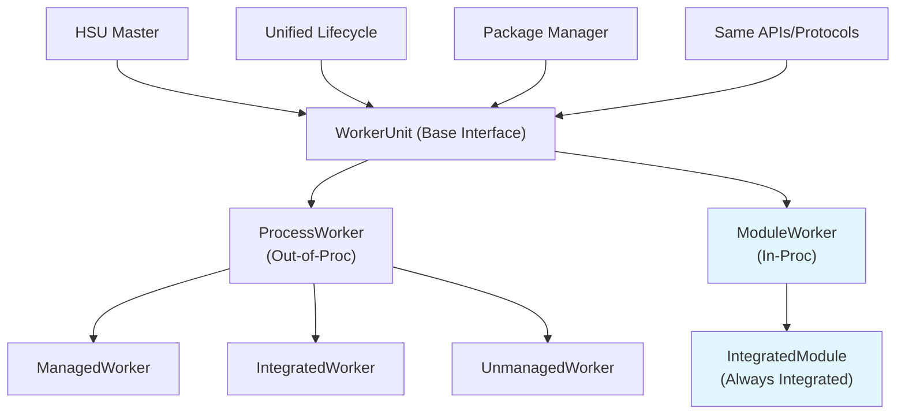

### Enhanced Application Architecture

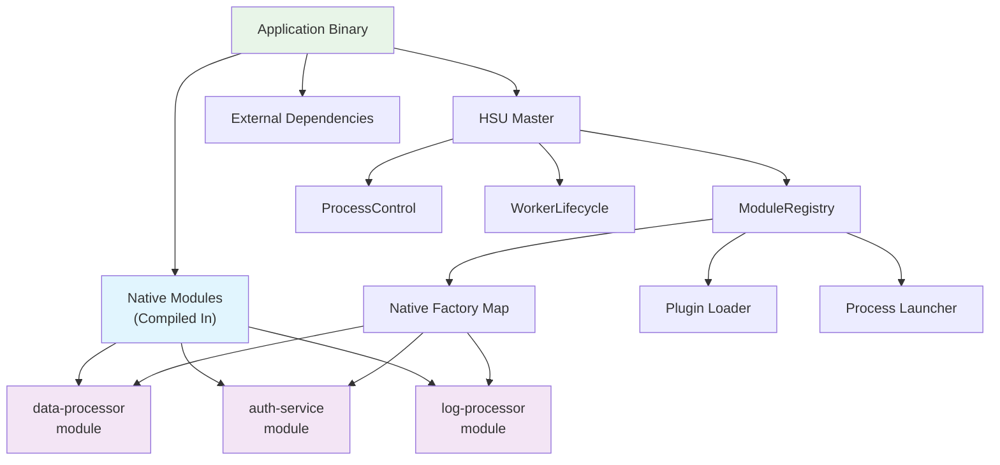

## State Machines

### Unified Worker State Machine

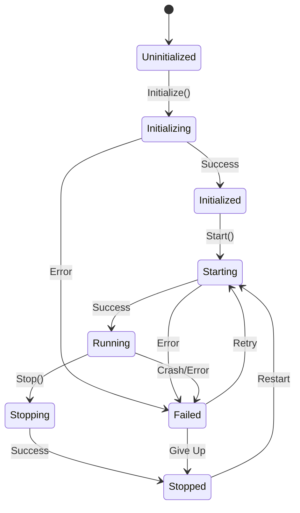

### Master Worker Management State Flow

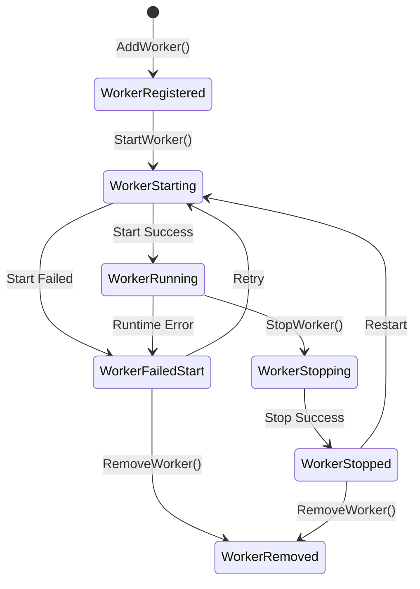

## Component Interaction Flows

### Module Registration and Startup Flow

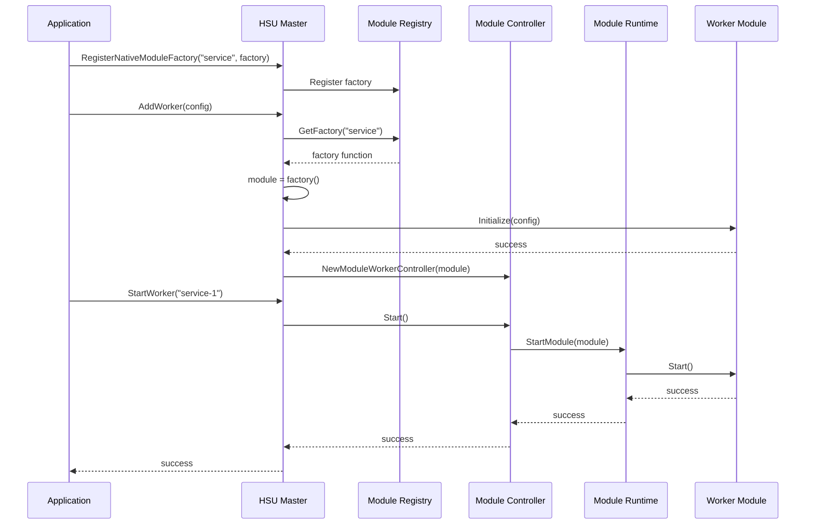

### Process vs Module Worker Comparison

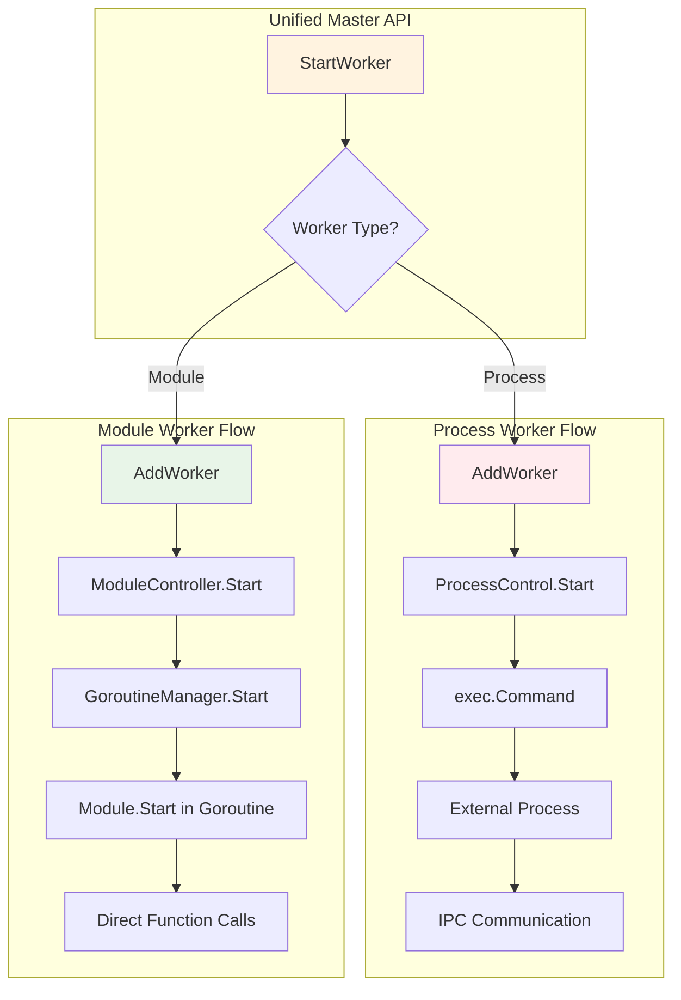

## Data Flow Diagrams

### Configuration to Runtime Flow

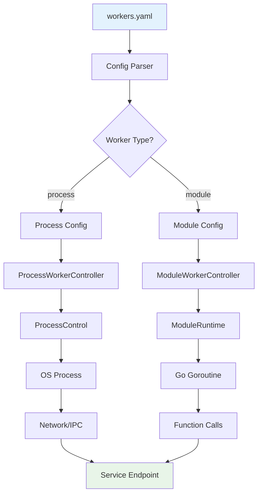

### Error Handling and Recovery Flow

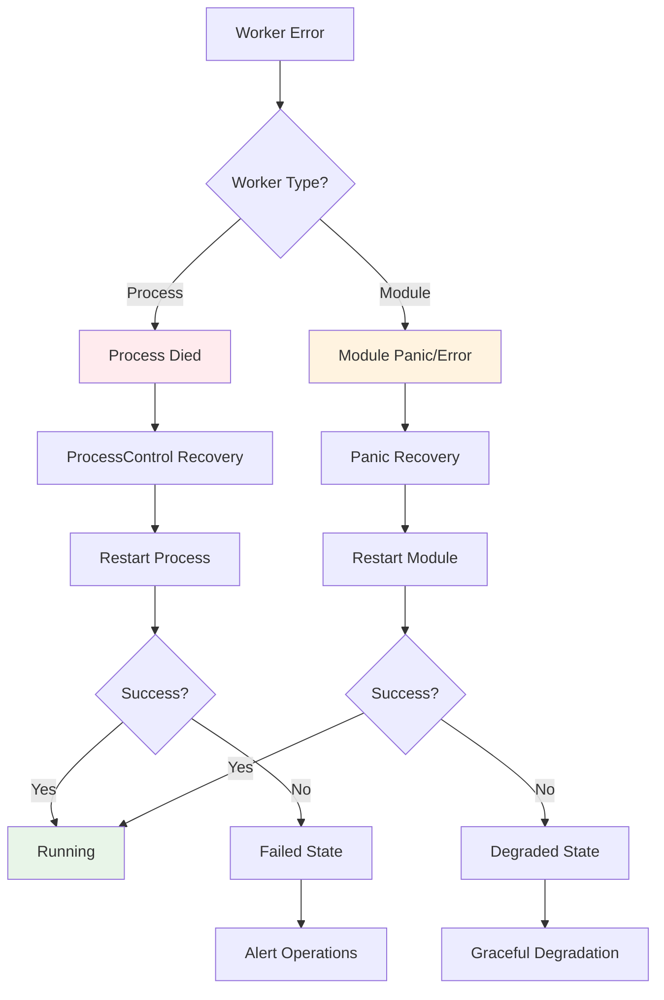

## Package Management Architecture

### Package Installation Flow

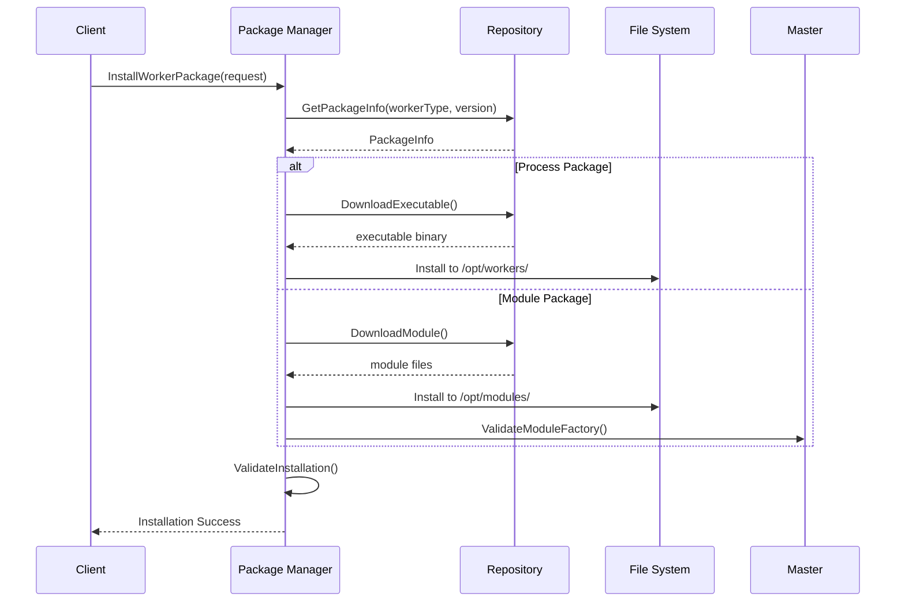

### Unified Package Support

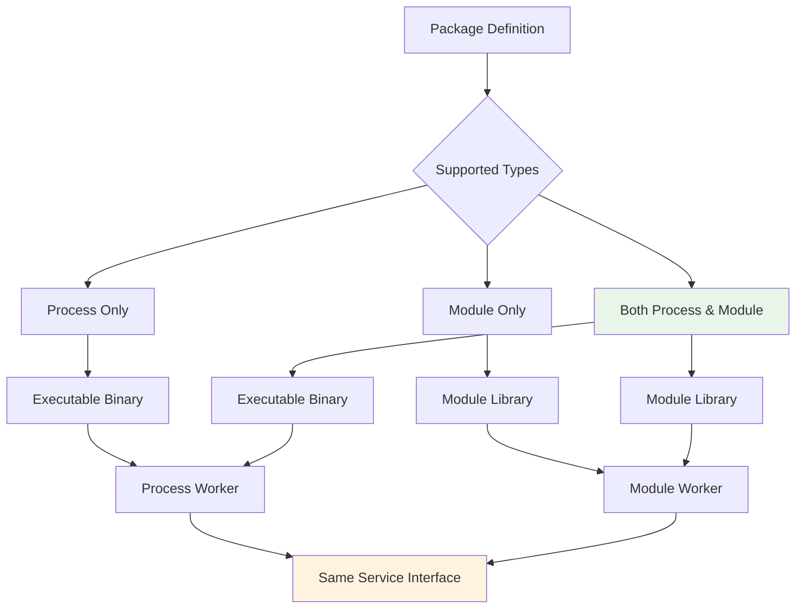

## Runtime Architecture

### Master Internal Architecture

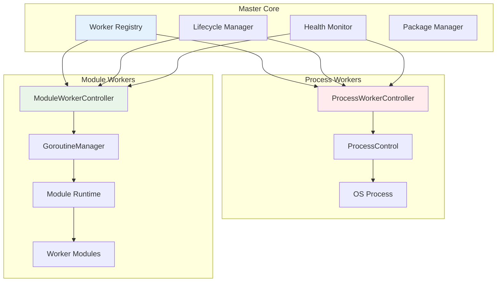

### Module Runtime Components

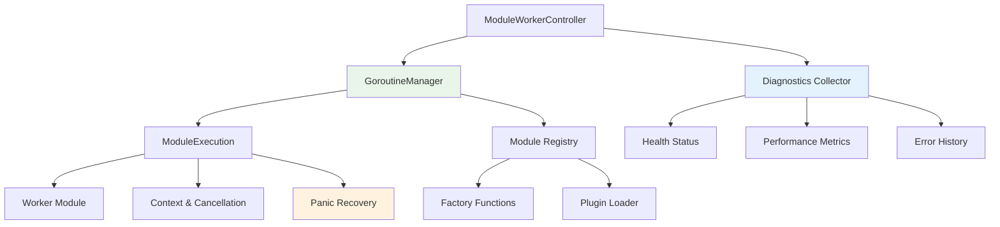

## Deployment Scenarios

### Development vs Production Deployment

```mermaid
graph TB
    subgraph "Development Environment"
        DA[Fast Iteration] --> DB[Module Deployment]
        DB --> DC[In-Process Execution]
        DC --> DD[Shared Memory]
        DD --> DE[Fast Debugging]
    end
    
    subgraph "Production Environment"
        PA[Fault Isolation] --> PB[Process Deployment]
        PB --> PC[Separate Processes]
        PC --> PD[Network Communication]
        PD --> PE[High Availability]
    end
    
    subgraph "Hybrid Environment"
        HA[Critical Services] --> HB[Process Deployment]
        HC[Supporting Services] --> HD[Module Deployment]
        HB --> HE[Maximum Reliability]
        HD --> HF[Resource Efficiency]
    end
    
    style DA fill:#e8f5e8
    style PA fill:#ffebee
    style HA fill:#fff3e0
```

### Scaling Patterns

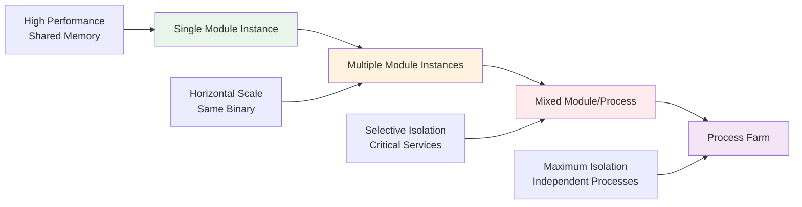

## Error and Recovery Patterns

### Failure Impact Comparison

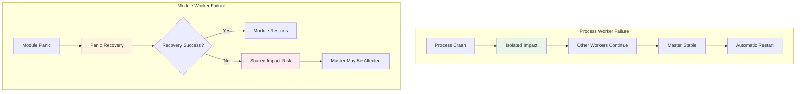

### Recovery Strategies

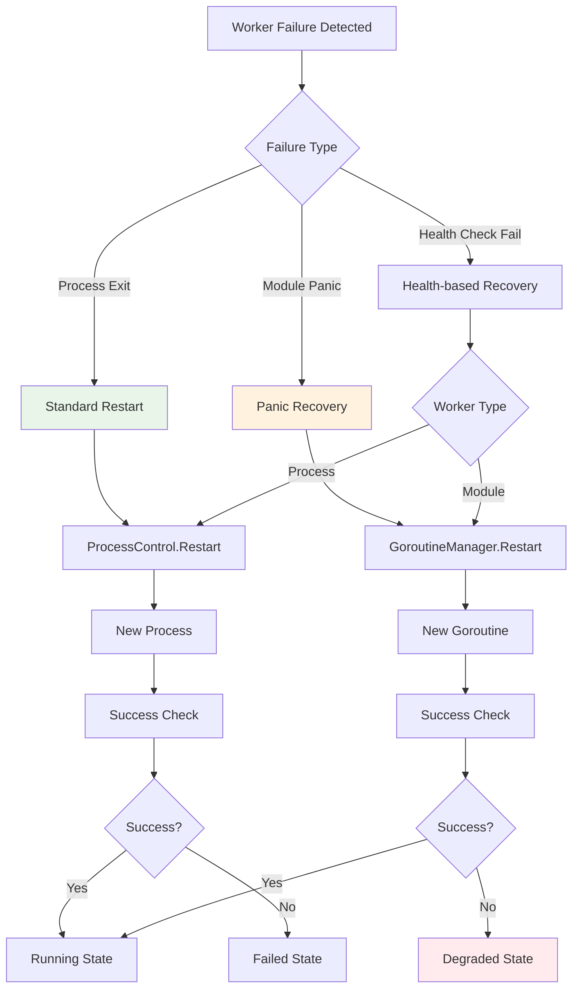

---

## Diagram Legend

### Colors
- 🟢 **Green (#e8f5e8)**: Module/In-process components
- 🔵 **Blue (#e3f2fd)**: Master/Core components  
- 🟡 **Yellow (#fff3e0)**: Shared/Common components
- 🔴 **Red (#ffebee)**: Process/External components
- 🟣 **Purple (#f3e5f5)**: Advanced/Optional components

### Shapes
- **Rectangles**: Components/Services
- **Diamonds**: Decision Points
- **Circles**: States
- **Rounded Rectangles**: Processes/Operations

---

## Related Documentation

- [Master Integration](master-integration.md) - Technical implementation details
- [Module Development Guide](module-development-guide.md) - How to create modules
- [Configuration and Usage](configuration-and-usage.md) - Application setup and usage
- [Implementation Guide](implementation-guide.md) - Development phases and considerations